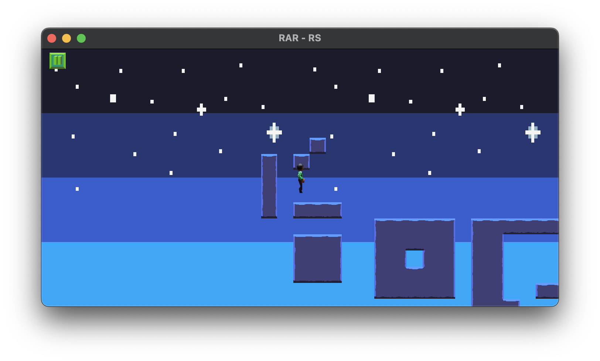

# rar-rs

:WIP:

Checkout the [TODO](rar-rs/TODO.md), the [ROADMAP](docs/ROADMAP.md),
and the [journey](docs/JOURNEY.md) so far.

You can checkout a preview of the latest version on [itch.io](https://omni-mad.itch.io/rar-rs) the password is `rar-rs`.

**Note:** macOS version only for now, sorry. You can build Linux & Windows versions from source yourself.
