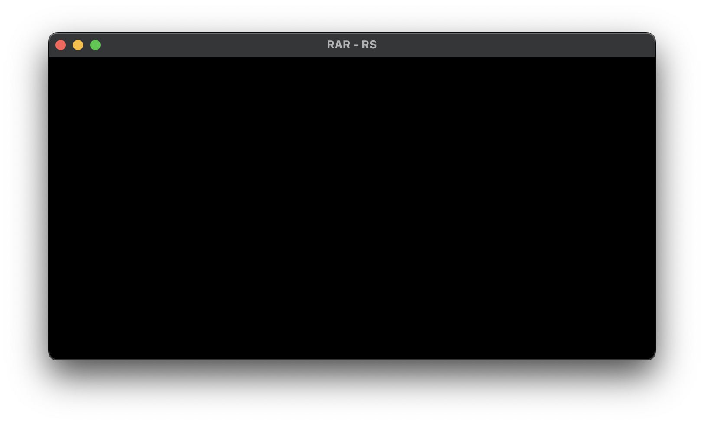
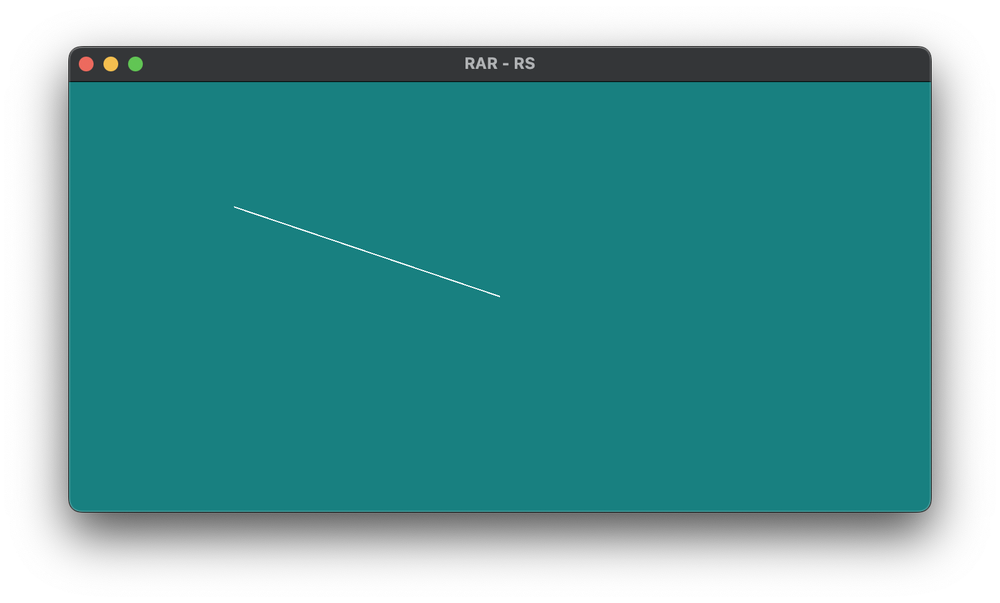

# The journey so far

## Notes
- Please take the LOC, time spent, and estimated costs with a grain of salt, they are just very rough estimates, and may be vastly wrong!
 
## v0.x

### Episode 0000

In episode 0000 we created the basic project setup,
splitting some common boilerplate game code into oml-game,
and adding the app specific (dummy) code to rar-rs.

All of this was heavily based on the previous project [fiiish-rs](https://github.com/andreasOM/fiiish-rs).

In the end we had a black window, that could be closed by pressing Escape.

- About 700 lines-of-code (LOC) created/copied 
- in about 1.5h (on stream) + 0h (off stream).
- Estimated Cost to Develop $300-$18,158 (lower number actual h * $100, higher number from scc)

### Episode 0001

In episode 0001 we actually got something rendering on the screen.
The input-update-render logic is driven by oml-game.
rar-rs is using the debug renderer to draw a line over the color cycling, clear background. The debug renderer can be toggled by pressing `i`.

- LOC: 4000
- Time: 2.0h+0.0h => 3.5h
- Cost: $350-$102,384

**:TODO:**

### Episode 0006
*Broken*

### Episode 0009
*Broken*
No oml-game branch.

### Episode 0025
*Broken*
Branch missing?

### Episode 0028

In episode 0028 we improved the layout of the settings dialog.
We added support for tagging UIElement instances,
so we could find them just by the tag, instead of having to supply the full path.
We also created a UiGridBox, to allow easier layouts for UI, and used it for the SettingsDialog.

The screenshot shows the SettingsDialog with the debug overlay enabled to show the underlying structure.

- LOC: 8000
- Time: 5.0h + 0.5h => 108.5h
- Cost: $14,450-$270,000

### Episode 0029

**:TODO:**

- LOC: 14000
- Time: 3.5h+2.5h (ongoing) => 114.5h
- Cost: $14,450-$360,000

### Epsiode 0030
*Broken*
No rendering even with `#[repr(C)]` fix?
