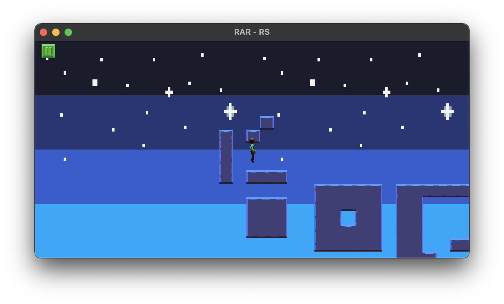

# The journey so far

## v0.x

### Episode 0028

In episode 0028 we improved the layout of the settings dialog.
We added support for tagging UIElement instances,
so we could find them just by the tag, instead of having to supply the full path.
We also created a UiGridBox, to allow easier layouts for UI, and used it for the SettingsDialog.

The screenshot shows the SettingsDialog with the debug overlay enabled to show the underlying structure.
